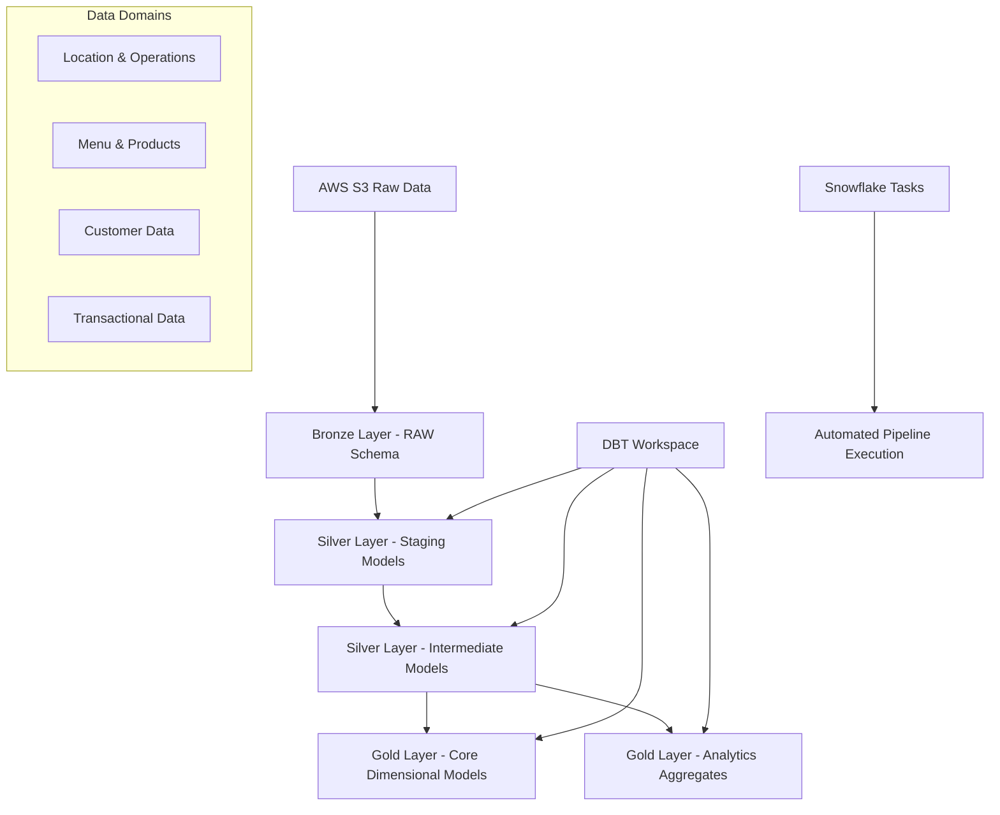

# 🍕 Modern Data Stack in Action: Tasty Bytes Analytics Platform

**Hands-on implementation of medallion architecture using DBT Projects on Snowflake**

[](https://docs.getdbt.com/)
[](https://www.snowflake.com/)
[](https://www.databricks.com/glossary/medallion-architecture)
[](LICENSE)

## 📖 About This Project

This repository demonstrates the practical implementation of modern data stack concepts using the **Tasty Bytes** food truck analytics platform. Built as a comprehensive tutorial, it showcases medallion architecture (Bronze, Silver, Gold layers) using Snowflake's native DBT Projects feature through hands-on, step-by-step implementation.

### 🎯 What You'll Build

- **Bronze Layer**: Raw data ingestion from AWS S3
- **Silver Layer**: Data cleansing, standardization, and enrichment
- **Gold Layer**: Business-ready dimensional models and analytics
- **Task Orchestration**: Manual Snowflake Tasks setup for pipeline automation
- **Complete Analytics Platform**: End-to-end food truck business intelligence

## 🏢 Business Context

**Tasty Bytes** is a fictional global food truck network spanning:
- 🌍 **15 countries** and **30 major cities**
- 🚚 **450 trucks** generating **$105M** in annual sales
- 📈 **Growth targets**: 1120 trucks and $320M by 2027
- 🎯 **Challenge**: Building a robust data platform to support expansion

## 🏗️ Architecture Overview



## 📚 Article Series Context

This is **Part 2** of the Modern Data Stack series:

1. **[Part 1: Theoretical Foundation](https://medium.com/@vikneshwararb_99226/modern-data-stack-for-analytics-medallion-architecture-dbt-the-elt-revolution-and-snowflake-45ee91ca6c14)**  
   *Medallion Architecture concepts, ELT Revolution, DBT fundamentals*

2. **[Part 2: Hands-On Implementation](https://medium.com/@vikneshwararb_99226/modern-data-stack-in-action-practical-guide-to-build-data-pipelines-with-dbt-projects-feature-on-592e5eb135c9)** ⬅️ **This Repository**  
   *Manual implementation with complete tutorial*

## 🚀 Getting Started

### Prerequisites

- **Snowflake Enterprise Edition** (30-day free trial with $400 credits)
- **GitHub Account** for repository management
- **Basic understanding** of SQL and data concepts in Snowflake
- **No prior DBT experience required** (Part-1 article include fundamentals)

### 1. Setup GitHub Integration

#### Create Personal Access Token
1. Navigate to [github.com/settings/tokens/new](https://github.com/settings/tokens/new)
2. Note: `dbt-git-user-token`
3. Expiration: `90 days`
4. Scope: ✅ `repo` (Full control of private repositories)
5. **Important**: Copy token immediately and store securely

#### Fork Repository
1. Visit [github.com/vikneshwara-r-b/food_truck_analytics](https://github.com/vikneshwara-r-b/food_truck_analytics)
2. Click "Fork" → "Create a new fork"
3. Repository name: `food_truck_analytics`
4. Your forked URL: `https://github.com/<your-username>/food_truck_analytics`

### 2. Snowflake Infrastructure Setup

#### Create DBT Service User
Execute in Snowflake as **ACCOUNTADMIN**:

```sql
-- Replace placeholders with your values:
-- <Password_for_User> → Your chosen password
-- <github-user-name> → Your GitHub username  
-- <github-pat-token-value> → Personal Access Token from Step 1

-- Creates: DBT_USER, DBT_ROLE, TASTY_BYTES_ANALYTICS_DBT database
-- Multiple schemas: RAW_POS, RAW_CUSTOMER, SILVER, GOLD, INTEGRATIONS
@initial_setup_and_ingestion/service_user_setup.sql
```

#### What Gets Created:
- **DBT_USER**: Service user for DBT operations
- **DBT_ROLE**: Role with appropriate permissions
- **TASTY_BYTES_ANALYTICS_DBT**: Project database
- **API Integration**: For GitHub connectivity
- **Schemas**: Organized by medallion layer

### 3. DBT Workspace Creation

#### Login as DBT User
- Username: `DBT_USER`
- Password: `<Password_for_User>`

#### Configure Workspace
1. Navigate to **Projects → Workspaces (Preview)**
2. Select **From Git repository**
3. Fill configuration:
   - **Repository URL**: `https://github.com/<your-username>/food_truck_analytics`
   - **Workspace Name**: `food_truck_analytics_dbt_project`
   - **API Integration**: `TB_DBT_GIT_API_INTEGRATION`
   - **Authentication**: Personal access token
   - **Credentials Secret**: `tb_dbt_git_secret`

### 4. Data Loading

#### Load Sample Data
```sql
-- In DBT Workspace, execute:
-- Role: DBT_DEV_ROLE
-- Warehouse: TASTY_BYTES_DBT_WH

@initial_setup_and_ingestion/tasty_bytes_enhanced_data_load.sql
```

#### Verify Data Load
Check schemas: **RAW_POS** and **RAW_CUSTOMER** for loaded tables.

## 📁 Repository Structure

```
food_truck_analytics/
├── models/
│   ├── staging/                    # Silver Layer - Data Cleaning
│   │   ├── _staging.yml           # Model documentation & tests
│   │   ├── stg_customer_loyalty.sql
│   │   ├── stg_pos_orders.sql
│   │   ├── stg_pos_countries.sql
│   │   ├── stg_pos_franchises.sql
│   │   ├── stg_pos_locations.sql
│   │   ├── stg_pos_menu.sql
│   │   └── stg_pos_trucks.sql
│   ├── intermediate/               # Silver Layer - Business Logic
│   │   ├── _intermediate.yml
│   │   ├── int_customers_segmented.sql
│   │   ├── int_orders_enriched.sql
│   │   └── int_menu_profitability.sql
│   ├── core/                      # Gold Layer - Dimensional Models
│   │   ├── _core.yml
│   │   ├── dim_customer.sql
│   │   ├── dim_location.sql
│   │   ├── dim_menu_item.sql
│   │   ├── dim_truck.sql
│   │   ├── fact_order.sql
│   │   └── fact_order_detail.sql
│   └── analytics/                 # Gold Layer - Business Aggregates
│       ├── _analytics.yml
│       ├── agg_customer_360.sql
│       ├── agg_daily_sales.sql
│       ├── agg_location_insights.sql
│       └── agg_menu_performance.sql
├── initial_setup_and_ingestion/
│   ├── service_user_setup.sql
│   └── tasty_bytes_enhanced_data_load.sql
├── orchestration_setup/
│   └── manual_orchestration_setup.sql
├── dbt_project.yml
├── packages.yml
└── README.md
```

## 🎯 Implementation Workflow

### Phase 1: DBT Project Setup

#### 1. Install Dependencies
```bash
# In DBT Workspace
Profile: dev
Click: Deps → DBT_ACCESS_INTEGRATION → Deps
```

#### 2. Compile Project
```bash
Click: Compile
# View DAG for model dependencies
```

#### 3. Build Utility Tables
```bash
Click: Run → Uncheck "Execute with defaults"
Additional flags: --select tag:utils
Click: Run
```

Creates essential dimension tables:
- **DIM_DATE**: Date dimension for time-based analysis
- **DIM_TIME**: Time dimension for granular analysis

### Phase 2: Deploy DBT Project

#### 1. Create Production Deployment
```bash
Click: Connect → Deploy DBT project
Database: TASTY_BYTES_ANALYTICS_DB
Schema: INTEGRATIONS
Project Name: food_truck_analytics_dbt_project
Click: Deploy
```

#### 2. Verify Deployment
Project now available for production task scheduling.

### Phase 3: Task Orchestration

#### 1. Create Task Graph
```sql
@orchestration_setup/manual_orchestration_setup.sql
```

Creates comprehensive task dependencies:
- **Silver layer transformations**
- **Gold layer dimensional models**
- **Data quality checks**
- **Proper execution sequencing**

#### 2. Execute Pipeline
1. Navigate: **Data → Databases → tasty_bytes_analytics_db → integrations**
2. Under **Tasks**, locate: `tasty_bytes_silver_staging_setup`
3. Click **Graph** to visualize dependencies
4. Go to **Monitoring → Task History**
5. Find root task → **Resume**

#### 3. Monitor Execution
Track progress through task graph visualization and execution logs.

## 🎨 Model Organization Strategy

### Tagging System
```yaml
# dbt_project.yml configuration
models:
  food_truck_analytics:
    staging:
      +materialized: view
      +tags: ["staging","silver"]
      +schema: "silver"
    intermediate:
      +materialized: table  
      +tags: ["intermediate","silver"]
      +schema: "silver"
    marts:
      core:
        +materialized: table
        +tags: ["core","gold"] 
        +schema: "gold"
      analytics:
        +materialized: table
        +tags: ["analytics","gold"]
        +schema: "gold"
```


## 📊 Data Domains

### 📍 Location & Operations
- Countries, cities, truck locations
- Franchise information and ownership
- Vehicle details and EV classification

### 🍕 Menu & Products  
- Menu items with pricing and costs
- Nutritional information
- Category classifications

### 👥 Customer Data
- Loyalty program information
- Demographics and preferences  
- Behavioral segmentation

### 📈 Transactional Data
- Order headers with timing/channel
- Item-level order details
- Pricing, discounts, profitability

## 🔍 Expected Results

Upon successful completion, the following entities are created in Snowflake.

### Silver Schema Tables
- Cleaned and validated data
- Standardized formats and types
- Quality flags and metrics

### Gold Schema Tables  
- **Dimensional models -** dim_customer, dim_location, dim_menu_item, dim_truck
- **Fact tables -** fact_order, fact_order_detail
- **Business aggregates -** customer_360, daily_sales, location_insights


## 🛠️ Key Learning Outcomes

After completing this tutorial, you'll understand:

### Technical Skills
- **Medallion architecture** implementation patterns
- **DBT model organization** and best practices
- **Snowflake Tasks** for pipeline orchestration
- **Data quality** testing and validation

### Business Applications
- **Customer segmentation** strategies
- **Operational analytics** for food service industry
- **Data-driven decision making** frameworks
- **Scalable analytics architecture** design

## 🚧 Limitations & Next Steps

### Current Manual Process Limitations
- **Manual task creation** for each deployment
- **No change tracking** or version control for tasks
- **Manual validation** of configurations
- **Limited scalability** for multiple projects

## 🤝 Contributing

We welcome contributions to improve this tutorial! Please:

1. Fork the repository
2. Create a feature branch: `git checkout -b feature/improvement`
3. Test your changes thoroughly
4. Submit a pull request with detailed description

## 📚 Additional Resources

### Snowflake Documentation
- [DBT Projects on Snowflake](https://docs.snowflake.com/en/user-guide/data-engineering/dbt-projects-on-snowflake)
- [Snowflake Tasks](https://docs.snowflake.com/en/user-guide/tasks-intro)

### DBT Documentation  
- [DBT Fundamentals](https://learn.getdbt.com/courses/dbt-fundamentals)
- [DBT Best Practices](https://docs.getdbt.com/guides/best-practices)

### Tasty Bytes Resources
- [Tasty Bytes Introduction](https://quickstarts.snowflake.com/guide/tasty_bytes_introduction/index.html)

## 🆘 Troubleshooting

### Common Issues

**DBT Workspace Not Loading:**
```bash
# Verify GitHub integration
# Check Personal Access Token expiration
# Confirm repository permissions
```

**Data Load Failures:**
```sql
-- Check role and warehouse settings
-- Verify file paths in S3
-- Confirm stage creation
```

**Task Creation Errors:**
```sql
-- Ensure DBT project is deployed
-- Verify role permissions for task creation
-- Check task naming conflicts
```

## 📄 License

This project is licensed under the MIT License - see the [LICENSE](LICENSE) file for details.

## 🙏 Acknowledgments

- **Snowflake** for DBT Projects feature and Tasty Bytes sample data
- **DBT Labs** for the transformation framework
- **Data engineering community** for best practices and patterns

## 📞 Support

- **Repository Issues**: [GitHub Issues](https://github.com/vikneshwara-r-b/food_truck_analytics/issues)
- **LinkedIn**: [Connect with the author](https://www.linkedin.com/in/vikneshwararb/)
- **Medium Articles**: Follow the complete series for context

---

*Built with ❤️ for hands-on data engineering learning*