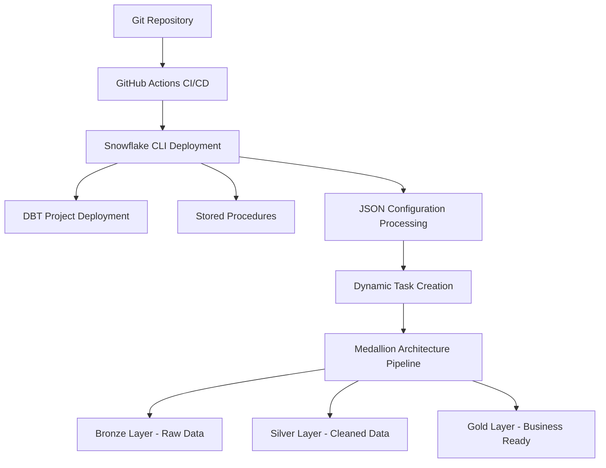

# 🚀 Advanced DBT on Snowflake: CI/CD and Dynamic Task Orchestration

**Enterprise-grade automation for modern data pipelines using DBT Projects on Snowflake**

[](https://docs.getdbt.com/)
[](https://www.snowflake.com/)
[](https://about.gitlab.com/topics/gitops/)
[](LICENSE)

## 📖 About This Project

This repository demonstrates how to transform manual DBT operations into enterprise-grade, automated data pipelines using Snowflake's native DBT Projects feature. Built around the **Tasty Bytes** food truck analytics platform, it showcases medallion architecture implementation with advanced CI/CD automation.

### 🎯 What You'll Learn

- **Dynamic Task Orchestration**: JSON-driven pipeline configuration
- **Intelligent Change Detection**: SHA-256 hashing for efficient deployments  
- **GitOps Workflows**: Complete CI/CD automation for data teams
- **Production-Ready Patterns**: From startup agility to enterprise scale
- **Medallion Architecture**: Bronze, Silver, Gold data layer implementation

## 🏗️ Architecture Overview



## 📚 Article Series

This repository is part of a comprehensive **Modern Data Stack** article series:

1. **[Part 1: Theoretical Foundation](https://medium.com/@vikneshwararb_99226/modern-data-stack-for-analytics-medallion-architecture-dbt-the-elt-revolution-and-snowflake-45ee91ca6c14)**  
   *Medallion Architecture, ELT Revolution, and DBT Fundamentals*

2. **[Part 2: Hands-On Implementation](https://medium.com/@vikneshwararb_99226/modern-data-stack-in-action-practical-guide-to-build-data-pipelines-with-dbt-projects-feature-on-592e5eb135c9)**  
   *Manual DBT implementation with Tasty Bytes use case*

3. **[Part 3: Enterprise Automation](https://medium.com/@vikneshwararb_99226/implementing-ci-cd-and-dynamic-task-orchestration-using-dbt-snowflake-projects-6397fb572a51)** ⬅️ **This Repository**  
   *CI/CD automation and dynamic orchestration*

## 🚀 Quick Start

### Prerequisites

- **Snowflake Enterprise Edition** with ACCOUNTADMIN privileges
- **GitHub Account** with repository management access
- **Git** installed locally
- **Basic understanding** of DBT and Snowflake concepts

### 1. Fork and Clone

```bash
git clone https://github.com/<your-username>/food_truck_analytics.git
cd food_truck_analytics
git checkout release/v.1.1
```

### 2. Configure GitHub Secrets

Navigate to **Settings → Secrets and variables → Actions** in your forked repository:

**Repository Secrets:**
```
SNOWFLAKE_ACCOUNT=your-account-identifier
SNOWFLAKE_USER=DBT_USER
SNOWFLAKE_PASSWORD=your-service-account-password
```

**Repository Variables:**
```
SNOWFLAKE_DATABASE=TASTY_BYTES_ANALYTICS_DB
SNOWFLAKE_SCHEMA=INTEGRATIONS
SNOWFLAKE_WAREHOUSE=TASTY_BYTES_DBT_WH
SNOWFLAKE_ROLE=DBT_DEV_ROLE
```

### 3. Initial Snowflake Setup

Execute the setup script in Snowflake to create required infrastructure:

```sql
-- Run as ACCOUNTADMIN
@initial_setup_and_ingestion/snowflake_setup.sql
```

### 4. Deploy Stored Procedures

```sql
-- Deploy the dynamic task framework
@orchestration_setup/config_driven_sp_definitions.sql
```

### 5. Trigger Deployment

Make any change to `metadata/tasty_bytes.json` and push to trigger the automated CI/CD pipeline.

## 📁 Repository Structure

```
food_truck_analytics/
├── .github/workflows/
│   └── dbt-snowflake-cicd-deploy.yml    # CI/CD pipeline definition
├── metadata/
│   └── tasty_bytes.json                 # Task configuration file
├── orchestration_setup/
│   └── config_driven_sp_definitions.sql # Stored procedure framework
├── models/
│   ├── staging/                         # Silver layer models
│   ├── intermediate/                    # Silver enrichment  
│   ├── core/                           # Gold dimensional models
│   └── analytics/                      # Gold business aggregates
├── initial_setup_and_ingestion/
│   └── tasty_bytes_enhanced_data_load.sql
├── dbt_project.yml                     # DBT project configuration
├── packages.yml                        # DBT dependencies
└── README.md                           # This file
```

## 🔧 Key Features

### ⚡ Dynamic Task Orchestration

JSON-driven configuration enables declarative pipeline management:

```json
{
  "project_config": {
    "database": "TASTY_BYTES_ANALYTICS_DB",
    "schema": "INTEGRATIONS",
    "project_name": "FOOD_TRUCK_ANALYTICS_DBT_PROJECT"
  },
  "tasks": [
    {
      "name": "silver_staging_setup",
      "enabled": true,
      "dbt_command": "run --select tag:silver,tag:staging",
      "depends_on": [],
      "schedule": "USING CRON 0 9-17 * * * UTC"
    }
  ]
}
```

### 🔍 Intelligent Change Detection

SHA-256 hashing ensures efficient deployments:
- **Zero-downtime**: Skip deployments when no changes exist
- **Audit trail**: Complete history of configuration changes  
- **Rollback capability**: Reference previous configurations for recovery

### 🛡️ Advanced Validation

- **Circular dependency detection** prevents infinite loops
- **Configuration schema validation** ensures structural integrity
- **Enabled task filtering** handles complex dependency chains

### 📊 Comprehensive Monitoring

Built-in observability and audit capabilities:

```sql
-- Monitor recent deployments
CALL show_task_creation_log('tasty_bytes');

-- View current feed status  
CALL show_feed_task_status('tasty_bytes');

-- List all feeds
CALL list_all_feeds();
```

## 🎮 Usage Examples

### Deploy a New Feed

1. Create JSON configuration in `metadata/` directory
2. Commit and push changes
3. CI/CD automatically validates and deploys
4. Monitor execution through Snowflake Task History

### Modify Existing Pipeline

1. Update task dependencies in JSON configuration
2. Push changes to trigger change detection
3. Only modified tasks are updated (zero downtime)
4. Verify deployment through monitoring procedures

### Emergency Rollback

```sql
-- Find previous working configuration
SELECT config_hash, loaded_at 
FROM dbt_task_config 
WHERE feed_name = 'my_feed' AND execution_status = 'SUCCESS'
ORDER BY loaded_at DESC;

-- Rollback to previous version
UPDATE dbt_task_config 
SET is_current = TRUE 
WHERE feed_name = 'my_feed' AND config_hash = 'previous_hash';
```

### Development Setup

1. Fork the repository
2. Create a feature branch: `git checkout -b feature/amazing-feature`
3. Make your changes and test thoroughly
4. Commit your changes: `git commit -m 'Add amazing feature'`
5. Push to the branch: `git push origin feature/amazing-feature`
6. Open a Pull Request


## 🛠️ Troubleshooting

### Common Issues

**Pipeline Fails During Deployment:**
```bash
# Check CI/CD logs in GitHub Actions
# Verify Snowflake credentials in repository secrets
# Validate JSON configuration syntax
```

**Tasks Not Created:**
```sql
-- Verify stored procedures are deployed
SHOW PROCEDURES LIKE '%dbt%';

-- Check configuration loading
SELECT * FROM dbt_task_config WHERE feed_name = 'your_feed';
```

**Change Detection Not Working:**
```sql
-- Manually check for changes
CALL has_config_changes('feed_name', 'config.json');
```

## 📋 Requirements

- **Snowflake**: Enterprise Edition (for DBT Projects feature)
- **DBT**: Version 1.9.2 or higher
- **GitHub Actions**: Enabled for CI/CD automation
- **Git**: Version 2.0 or higher

## 📄 License

This project is licensed under the MIT License - see the [LICENSE](LICENSE) file for details.

## 🙏 Acknowledgments

- **Snowflake** for the innovative DBT Projects feature
- **DBT Labs** for the foundational data transformation framework
- **Tasty Bytes** sample data for realistic use case scenarios

## 📞 Support & Community

- **Issues**: [GitHub Issues](https://github.com/vikneshwara-r-b/food_truck_analytics/issues)
- **Discussions**: [GitHub Discussions](https://github.com/vikneshwara-r-b/food_truck_analytics/discussions)
- **LinkedIn**: [Connect with the author](https://www.linkedin.com/in/vikneshwararb/)

---

## 🌟 Star This Repository

If this project helped you implement modern data stack automation, please ⭐ star this repository to show your support!

---

*Built with ❤️ for the data engineering community*